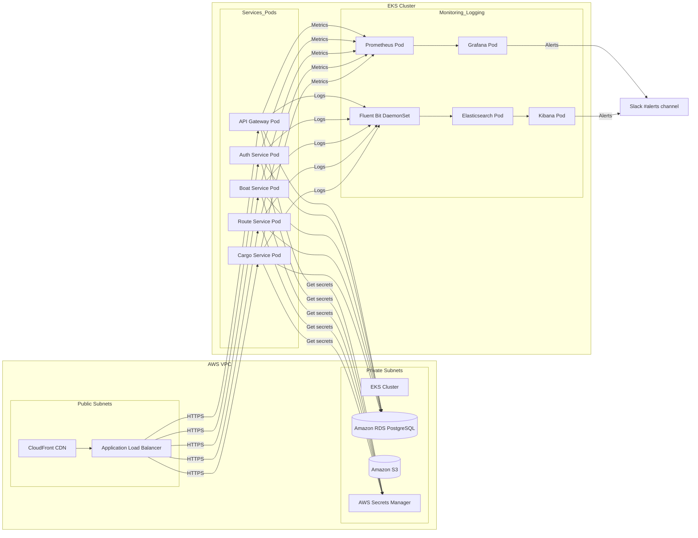

# PortTrack: Plataforma de Navegación Portuaria

## Descripción del Proyecto
PortTrack es una solución integral desarrollada para la **gestión y monitoreo en tiempo real** del flujo de embarcaciones en un puerto comercial. Permite a las autoridades portuarias:
- **Gestionar el inventario** de barcos dentro y fuera del muelle.
- **Administrar operaciones** de carga y descarga de mercancías.
- **Coordinar personal** y recursos involucrados en cada operación.
- **Supervisar rutas** de entrada y salida de embarcaciones.
- **Realizar seguimiento marítimo** en tiempo real para optimizar eficiencia y seguridad.

El proyecto está basado en tecnología **cloud-native** desplegada en **AWS**, combine microservicios en **Kubernetes (EKS)**, infraestructura como código con **Terraform**, CI/CD automatizado (GitHub Actions + AWS CodeDeploy), monitoreo con **Prometheus/Grafana** y **ELK Stack**, y flujos de ChatOps integrados en **Slack**.

## Estructura del Repositorio
```
/
├── infra/                   # Terraform para VPC, EKS, CodeDeploy, RDS
│   ├── main.tf
│   └── codedeploy.tf
├── k8s/                     # Manifiestos y configuración de Kubernetes
│   └── prometheus.yml
├── logstash/                # Pipeline de Logstash para ELK
│   └── logstash.conf
├── dashboards/              # Dashboards de Grafana (JSON)
│   └── grafana-global-dashboard.json
├── iam/                     # Políticas IAM de ejemplo
│   └── boat-service-secrets-policy.json
├── .github/
│   └── workflows/           # Workflows de GitHub Actions
│       └── ci-cd-pipeline.yml
├── Jenkinsfile              # Declarative Pipeline para Jenkins
├── ARCHITECTURE.md          # Diagrama Mermaid de la arquitectura
├── README.md                # Este archivo
└── scripts/
    └── deploy_via_codedeploy.sh  # Script de despliegue en producción
```

## Arquitectura
La solución se compone de:
- **AWS VPC** con subredes públicas y privadas.
- **Amazon EKS** para orquestar microservicios Docker en contenedores.
- **Amazon RDS** (PostgreSQL) para datos transaccionales.
- **Amazon S3** para almacenamiento de activos y backups.
- **AWS Secrets Manager** para gestión segura de credenciales.
- **AWS CodeDeploy** configurado en modo Blue-Green para zero-downtime.
- **Prometheus + Grafana** en Kubernetes para recolección de métricas y dashboards.
- **ELK Stack** (Fluent Bit → Elasticsearch → Kibana) para centralización de logs.
- **Slack + Hubot** para ChatOps: notificaciones y comandos operativos.
# Arquitectura Propuesta

A continuación se presenta el diagrama Mermaid de la infraestructura propuesta para la plataforma PortTrack:



## Flujo CI/CD
1. **Push** a `main` en GitHub → dispara **GitHub Actions**.
2. **Build** de contenedores Docker y ejecución de pruebas unitarias.
3. **Push** de la imagen a **Amazon ECR**.
4. **Deploy** a **Staging** via `kubectl apply`.
5. Aprobación manual para **Producción**.
6. **Despliegue Blue-Green** en producción con **AWS CodeDeploy**.
7. **Notificaciones** en Slack (#deployments, #alerts).

Detalla los pasos en `.github/workflows/ci-cd-pipeline.yml` y `Jenkinsfile`.

## Monitoreo y Alertas
- **Prometheus** captura métricas de CPU, memoria, latencia y tasa de errores.
- **Grafana** visualiza KPIs en dashboards personalizados.
- **Alertmanager** envía alertas a Slack ante anomalías (CPU alta, error rate, etc.).
- **Fluent Bit** envía logs a **Elasticsearch**, explorables en **Kibana**.
- Dashboards JSON en `dashboards/`.

## ChatOps
- Integración Slack con **Hubot**.
- Canales dedicados: `#deployments`, `#alerts`.
- Comandos: deploy, rollback, status, consultar logs y métricas.
- Flujos de incidentes: creación automática de canales de emergencia.

## Contribución
1. Clona este repositorio.
2. Instala requisitos (Terraform CLI, AWS CLI, kubectl).
3. Configura tus credenciales AWS y accesos a Slack/GitHub.
4. Modifica y prueba en entornos DEV/STAGING.
5. Envía PR con descripciones claras y pruebas.
6. Sigue las normas de estilo de código y revisiones de seguridad.

## Licencia
MIT © 2025 PortTrack Inc.

